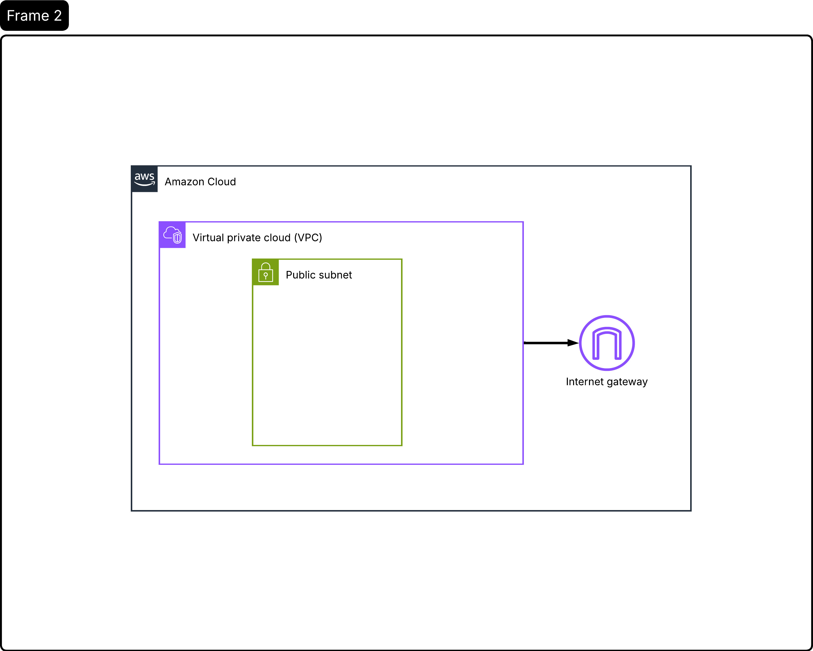
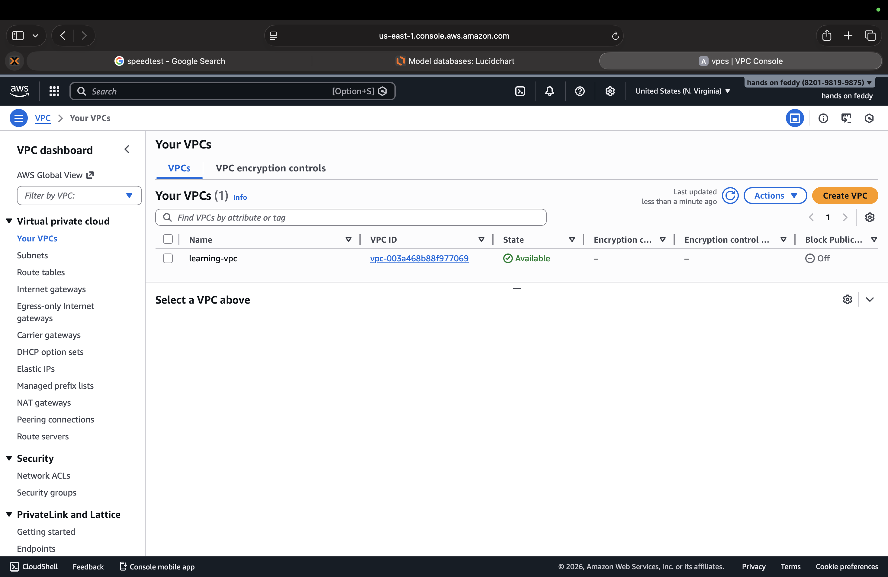

# Building a Virtual Private Cloud (VPC) on AWS

## 📌 Introducing Today’s Project

In this project, I built a **Virtual Private Cloud (VPC)** on AWS to understand the fundamentals of cloud networking.  
The objective was to create an isolated network environment, configure a **public subnet**, attach an **Internet Gateway**, and understand how resources inside a VPC can be accessed from the internet.

To strengthen my learning, I implemented the same architecture using:
- **AWS Management Console**
- **Terraform (Infrastructure as Code)**

This helped me compare manual configuration with automated and repeatable infrastructure provisioning.

---

## ☁️ What is Amazon VPC?

Amazon VPC (Virtual Private Cloud) allows you to provision a **logically isolated network** within AWS.  
It gives you control over:
- IP address ranges
- Subnets
- Routing
- Internet access

A VPC is similar to running your own private data center, but with the scalability and security of AWS.

---

## 🏗️ Virtual Private Cloud – What I Did

In this step, I created a custom VPC with the following configuration:

- Defined a private IPv4 CIDR block
- Enabled DNS resolution and DNS hostnames
- Attached an Internet Gateway
- Created a public subnet
- Configured routing for outbound internet access

This setup forms the foundation of most AWS architectures.

📸 *VPC overview page*

---

## ⚙️ How VPCs Work (Concept Overview)

A VPC uses multiple components working together:
- **CIDR blocks** define IP ranges
- **Subnets** divide the network
- **Route tables** control traffic flow
- **Gateways** manage access to external networks

By default, resources inside a VPC are isolated.  
Internet access must be **explicitly configured**, which improves security.

---

## 📐 Defining IPv4 CIDR Blocks

For this project, I used:

- **VPC CIDR:** `10.0.0.0/16`
- **Public Subnet CIDR:** `10.0.1.0/24`

This structure:
- Allows room for future expansion
- Keeps networking predictable
- Avoids conflicts with common home networks

Understanding CIDR blocks is critical when designing scalable and secure cloud networks.

---

## 🌐 Subnets

Subnets are divisions of a VPC that group resources by access requirements.

In this project, I created:
- **One public subnet**

Key configurations:
- Assigned to a specific Availability Zone
- Enabled automatic public IP assignment
- Associated with a route table pointing to the Internet Gateway

Without proper subnet and routing configuration, resources remain inaccessible from the internet.

📸 *Subnet settings page*

---

## 🌍 Internet Gateway and Routing

To enable internet access, I:
- Created an **Internet Gateway**
- Attached it to the VPC
- Updated the route table with:
  - `0.0.0.0/0 → Internet Gateway`
- Associated the route table with the public subnet

A subnet is only considered *public* when it has a valid route to an Internet Gateway.

📸 *Route table showing IGW*

---

## 🧱 Infrastructure as Code with Terraform

After completing the setup in the AWS Console, I recreated the same infrastructure using **Terraform**.

Using Terraform allowed me to:
- Define infrastructure declaratively
- Version-control cloud resources
- Recreate the environment consistently
- Reduce configuration errors

This reinforced the importance of **Infrastructure as Code (IaC)** in modern cloud and DevOps workflows.

📸 *Add screenshot here: Terraform plan/apply output*

---

## 🧠 Personal Reflection

This project helped me understand how AWS networking components work together rather than in isolation.  
One key takeaway was learning that **internet access is not automatic**—it depends entirely on correct routing, gateways, and subnet configuration.

Rebuilding the same architecture using Terraform improved my confidence in:
- AWS networking fundamentals
- Translating manual steps into code
- Debugging common VPC issues

This project is part of my ongoing journey toward becoming a **Cloud Engineer**.

---

## 🚀 What’s Next?

- Launch an EC2 instance in the public subnet
- Configure security groups for SSH access
- Create a private subnet
- Add a NAT Gateway
- Configure a remote Terraform backend (S3 + DynamoDB)

---

## 🔗 Repository Notes

- Terraform state files are excluded using `.gitignore`
- This project is for learning and experimentation
- Infrastructure can be safely recreated using Terraform

---

## 👤 Author

**Felix Appiah-Kubi**  
Aspiring Cloud Engineer | Learning AWS & Terraform  
